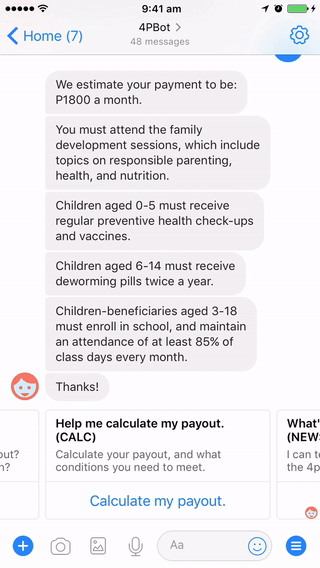

Cess lives in Las Piñas, in the greater Manila metro area. She's a proud mother of three, and her household is supported in part by the Pantawid Pamilyang Pilipino Program (4Ps for short), the Philippines national social welfare program, which gives financial assistance to housholds who are deemed the 'poorest of the poor'.

Cess is meant to recieve payments for each of her children who are in school, at a maximum of 3 children. Since her three kids are in school, this should entitle her to 1,800 PHP (~25 USD at the time of writing) per month.

The problem is that Cess isn't recieving payments for her youngest child, who started elemantary school 6 months ago.

So what can Cess do about her situation? Can she complain to authorities? Yes. But she is afraid to. She's heard stories of other people losing their payouts when they complain, and she doesn't want to seem ungrateful for the assistance she is already receiving. Can she fill out a form to update her child's details? Yes. But she's already waiting on the results of one form she filled out to be processed, what good is another form going to do? 

So maybe she can just wait. Perhaps in two months time, when the next payments are due, she will get the full amount, and not need to follow it up any further. Cess' story is just one of many that we've heard in the last 10 months as we've been working on 4PBot.

4PBot is a chatbot that helps people to navigate the social welfare program in the Philippines. We at Vessels Tech built 4PBot as a part of a grand challenge from DFS Lab, an investor-slash-incubator, who focus on improving access to financial services for the poor.

In this post, I want to give you an overview of what we learned from the process of building 4PBot, and hopefully demonstrate the potential that we see for this project and others like it to succeed in assisting low income people to access financial services in emerging markets.

## Background

The 4Ps is one of the world's biggest conditional cash transfer programs, serving over 4.3 million households across the Philippines. It is run by the Filipino Department of Social Welfare and Development (DSWD) and has been running since 2007. 

The grant is disbursed every 2 months, primarily to household mothers or grandmothers, and consists of:
- **Health**: P500 per month per household
- **Education**: Up to three children, P500 per child in high school, P300 per child in elementary school 

In order to receive a full payment, there are a number of conditions that need to be met:
- Pregnant women must go to pre-natal and post-natal care and be attended by a health professional at childbirth
- Parents/guardians must attend monthly family development session, which address topics such as responsible parenting, health and nutrition
- Children aged 0-5 must receive regular check-ups and vaccines
- Children aged 6-14 must receive deworming pills twice a year
- Children aged 3-18 must enroll in school, and maintain an attendance of at least 85% of class days every month

Disbursement has been a key challenge throughout the life of the program, as for many logistics in a nation of over 7,000 islands. Most payouts occour either in person or through the use of ATM cash cards.

## Our Approach

We started this project with a significant research phase. During this phase, we met with program stakeholders, conducted in person interviews of 4Ps beneficaries, and conducted surveys. We took a less-traditional approach to surveying, in that we used Facebook in addition to traditional paper-based surveys.

*Side note: Facebook*

>Facebook turned out to be a powerful tool for the research and implementation of 4PBot. At the start of our research, we found that a large number (25,000+) of 4Ps beneficaries were already self organising in Facebook groups, offering advice, support and chatting about their lives and the 4Ps program. This is in part because of Facebook Free Basics, which allows users to use a limited subset of Facebook's features without needing to purchase mobile data.
>
>We managed to get trusted in these groups and simply started asking people questions about their experiences with the program. This gave us a direct channel that traveresed the entire Philippines - something paper wouldn't have been able to give us for sure.

We came away from this research phase with 3 key ideas that guided our product development:
1. The power dynamic between 4Ps beneficiaries and govt. workers means many issues go unresolved.
2. Payment dates are unpredictable, making it difficult for beneficiaries to plan or budget ahead of time.
3. Gossip, misinformation and confusion is commonplace from one barangay (village) to another.

>“The 4P is a big help in our family... but in the aspect of announcing to us, it is a little hard because sometimes we don’t know when the payout day is, it would be better that they send us an SMS...” - Maria, 4Ps client

We heard this quote from Maria, a 4Ps beneficary from Toledo. It was an encouragement to us at the start of our work, as this is the potential for technology that we want to see at Vessels Tech!

## The Bot

4PBot runs in Facebook Messenger. It speaks Tagalog, Bisaya and English, and is available to users on Facebook Free Basics. It has a collection of menu-driven conversations, which users can select from and interact with.

### Onboarding

- User selects language, Tagalog, Bisaya/Cebuano, or English
- Asked for mobile number, or can skip (in early versions, we didn't offer this option and people gave up)
- User is given a scrollable menu where they can select between conversations with the bot

### Report a Payout Date

- Crowdsources payout dates to help predict future dates - this was an early feature we pulled out, as this data is hard to come by.
- The system is built to handle flexible inputs - relative dates, and plain-text locations
- Many beneficiaries post on Facebook groups when they have received their payout, and they posted it here also

### Make a Report

- Allows user to anonymously report issues they have been facing in the program.
- 4PBot is able to collect data that is sensitive or personal, or users are afraid would get them in trouble
- Users can share details they are afraid or embarrassed to share 

### Calculate My Payout

- A payment calculator, based on the situation of the individual
- Helps beneficiaries figure out if they are receiving the wrong amount
- Also reminds them of the conditions they need to meet

### Get the Latest News

- 3 short news items
- Translated and curated by our team
- Mostly about DSWD and the future of 4Ps - this was a popular topic!

## Technology Stack

We built 4Pbot in a modular way, to allow for a reusable and extendable system. The core of 4PBot was implemented with BotKit, an open source bot building framework. We chose open source as we didn't want to be locked into any specific bot building platform. This means we can pick up what works for Facebook Messenger, and pretty easily move it over to a different messaging service such as Slack or Viber. We can also build out or own extensions, which is what we're planning to do with 4PBot over SMS.

Instead of running servers and a big 'ol database, we opted for Google's Firebase Functions and Database. This offers us very cheap, reliable storage and compute, and makes the system incredibly scalable and configurable. To scale from 100 users to 1 million, there is very little we would need to change about the system.

Finally, we used Google Sheets to manage our translations, and to get data in and out of the Bot's database. This was critical as we needed an easy way for our translator to quickly translate the bot's messages and responses. We tied this together with Zapier, in a solution which suits the title "nifty". I've actually written a post about using this solution to easily get data out of chatbots, you can check it out [here](https://medium.com/vessels/chatfuel-google-sheets-zapier-8de5c988d10b) if you're interested.

## Findings

Based on our user tests, in-person feedback, and feedback from within 4PBot itself, we had the following insights:

**The good:**
- Beneficiaries trusted 4PBot with personal information.
- People loved to chat! So we built out a 4Pbot chat feature.
- Many thought it was a real person!

**Less Good:**
- Facebook is hard to use for many beneficiaries
- Payday predictor was not accurate enough

4PBot collected the following reports:

>“The children of our parent leader aren't studying anymore but the I don't know why they still recieve cash grants.”
> - anonymous 4Ps client

Above is a report of corruption taking place within the program. A parent leader is a 4Ps beneficary who also helps to organise a small group of 4Ps beneficaries. Since this parent leader's children were no longer in school, they shouldn't recieve any more payouts, but this was reportedly not the case above.

**Feedback:**
- Our users wanted more regular 4PBot news updates. They liked them, but it seems there wasn't enough!
- Users also wanted more help with the questions and reports they filed. At the moment 4PBot isn't equipped to do this, but we're going to be working on this soon.
- Finally, our users wanted help understanding the future of the 4Ps. There are lots of rumours circulating about the end of the program, and this adds to stress and anxiety for the parents.

Overally, they gave us a rating of 2.5/3 smileys.

Since releasing 4PBot live on Messenger, it's had over 300 unique users, with 111 monthly active users in the midst of our big marketing push in December. Based on 4Ps beneficaries on Facebook alone, we estimate a total market size of 25,000, but we're hoping to switch over to SMS and IVR soon so we can capture an even bigger market.

Our conversations had a completion rate of **88.9%**, which I consider reasonable, especially considering that many of our users had little experience with chatbots before.

## Next Steps

We believe that 4PBot can be used to amplify the agency of indviduals facing complex bureaucratic processes. We see the potential for 4PBot to help build safe and supportive communities. And we also see how 4PBot can be used to strengten and enhance the existing processes inside of the 4Ps program.

Now that we've done the research and laid the groundwork, we're going to be working on the next features for 4PBot:
1. Building a **4PBot Community** (think Quora or Stack Overflow for 4Ps), that works over Facebook Messenger, SMS and IVR. We're also going to work on **form automation** prefilling the required forms for users to follow up complaints with the problems the're facing.
2. **Impact analysis, fraud detection and program evaluation** We think 4PBot can be used to deliver top level insights into the inner workings of the 4Ps program, and we can use the data collected by 4PBot in a safe and responsible manner to help facilitate better monitoring.
3. **Link in with DSWD, integrate 4PBot into service delivery** In order for 4PBot to reach its full potential, it must integrate with the existing 4Ps processes. We hope that by working with the DSWD, we can see that integration take place, and improve the service delivery of the 4Ps and other related programs.

### Stakeholder interest:

From our initial meetings and conversations in the Philippines, we've seen some interest in what we are doing. Some examples include:

- Hapinoy, which trains micro entrepreneurs to impact needy communities across the Philippines were interested in 4PBot for training their entrepreneurs.
- We had some early talks with another social enterprise about using 4PBot's approach for improving service delivery, gathering insights into the program and fraud detection
- We also talked with the Office of Senate, and they were specifically interested in how they might use 4PBot for better monitoring & evaluation and 3rd party accountability of government programs.

### Closing Thoughts

Finally, I'd love to close on a big thank you to [DFS Lab](http://www.dfslab.net/), not only for supporting our project financially, but for your advice and guidance.

We're hopeful that we will get to continue working on 4PBot, and we see great potential in this approach to transform the lives of low income people facing complex bureaucratic systems.

We're in the process of looking for partners or other areas where we can apply our experience with 4PBot. If you have an idea or just want to chat about it, please get in touch with me at: lewis [at] vesselstech.com. You can learn more about our work at [vesselstech.com](https://vesselstech.com)

>>If you enjoyed this guide, or have any suggestions or questions, let me know in the comments. If you liked this post, give it a ❤️ or a 👏, or whatever you crazy cats are calling it nowadays.