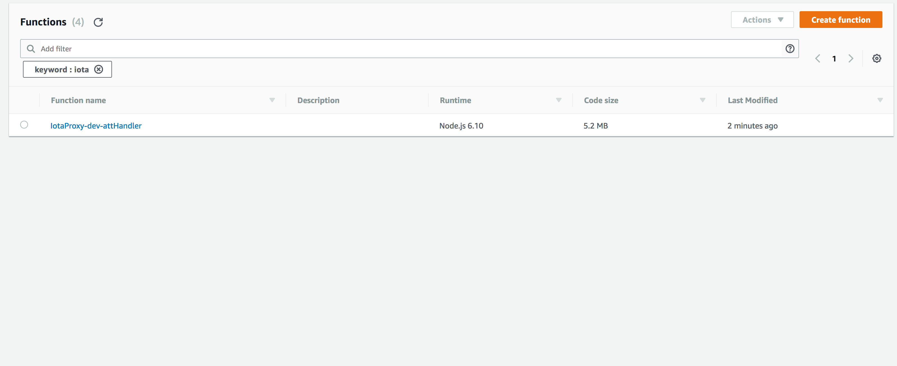

A little while back, I worked on little demo of performing IOTA Proof of Work on AWS Lambda Functions. 

I never got around to writing a tutorial, so I thought I'd get back to turning it into a proper `npm` package, and making an easy-to-deploy environment. 


## Why?

Why would we want to perform the PoW in AWS Lambda? 

Well for a number of reasons:

- You don't want to host your own IOTA Full Node, but you can't or don't want to perform PoW on your local device.
- You want an easy way to provision basic resources for a service you're writing, but want to be able to scale your resources super quick.
- You're using a public IOTA node that doesn't support `attachToTangle`.


## How does I get it working?

Three steps:

1. You deploy a [serverless](https://serverless.com/) service from the template found in [here](https://github.com/vessels-tech/iota-lambda) (an AWS Account is required)
2. `yarn add iota-lambda-shim` to your IOTA JS Project
3. Add the following lines of code to shim your iota api:
```js
const IotaLambdaShim = require('iota-lambda-shim');

// Patch the current IOTA instance
IotaLambdaShim({iota, lambda, functionName});
```
Where `iota` is your iota library instance, `lambda` is your AWS Lambda client, and `functionName` is the name of the lambda function you deployed.


## How does it work?

Using black magic. Ok well maybe not quite, but there's a few cool tricks going on here.

If you're following along with the [code](https://github.com/vessels-tech/iota-lambda), the trick is in `sls_iotaProxy/AttHandler.js`. This is a request handler run by the lambda function. We give it the parameters needed for a normal `attachToTangle` command, and it is executed on AWS lambda.

The second trick is that `ccurl` is kind of fiddly (compared to other node_modules), and needs to be complied on the exact architecture it is running on. The way functions are deployed with dependencies, normally you install your node modules and zip them all up to the lambda function, which normally works fine - but this is not the case with the tools we are using.

Instead, we install and compile the lambda function from inside of Docker. If you look at `Dockerfile`, you will see that it's `FROM amazonlinux:latest`. This is so the environment running the AWS Lambda is the same as what we compile with.


## Please, Just walk me through it!

### Setting up and Deploying the Lambda

Ok! Let's go from scratch.

I'm going to assume you have [docker], [docker-compose] and the [aws command line tools], along with an active profile installed. Let's check:

```bash
$ docker --version
$ docker-compose --version
$ aws s3 ls
```

Our `docker-compose.yml` file also uses our aws credentials, so make sure you have them in your file system like so:

```bash
$ cat ~/.aws/credentials
[vessels-lewis.daly]
aws_access_key_id = *****
aws_secret_access_key = *********
```

We should edit the `_env.sh` file to point to the correct AWS Account - this is just a handy way to switch between multiple AWS accounts using environment variables. My profile is called `vessels-lewis.daly`.

```sh
export AWS_PROFILE=vessels-lewis.daly
```


Should all this work (please let me know if you're having trouble), you then can run:

```bash
#build the docker container
$ ./_enter_docker.sh build 

#enter the container
$ ./_enter_docker.sh
```

Once inside the running container, ensure your credentials have been mounted and the `AWS_PROFILE` environment variable have been set properly:
```bash
$ echo $AWS_PROFILE
```

If that's all working like it should, run
```bash
$ ./_deploy.sh
```

And the IOTA Lambda function will be deployed. This tends to take a little while, there's a lot of stuff going on underneath, like packaging up the lambda function, and using cloudformation to deploy it.

Once deployed, note down the name of your lambda function name. Mine is `IotaProxy-dev-attHandler` really rolls off the tounge, doesn't it? If you log into the AWS console, you should be able to see it there. 




Ok. Hard part over, now let's move onto actually using this lambda with the IOTA JS Client.

### Using the Lambda

In order to use the Lambda, we're going to use a pretty similar approach to [this](https://github.com/iotaledger/curl-remote). This is an example of 'monkey patching' the IOTA client for use with the PowBox - but it's pretty close to what we're trying to do.

For further reading, take a look at the `examples` in the [repo](https://github.com/vessels-tech/iota-lambda), but I'll write it out here step by step anyway.

1. Install the `iota-lambda-shim` package. I assume you already have the iota package(s) installed.

```bash
yarn add iota-lambda-shim aws-sdk
```

2. Make a note of your `provider` (this can be a public full node that doesn't support AttachToTangle) the `functionName`. Put them in a config file like so:

`config.js`
```js
module.exports = {
  provider: 'http://5.9.149.169:14265',
  functionName: 'IotaProxy-dev-attHandler',
}

```

3. Now when you setup your IOTA library, do the following:

```js
/*iota library */
const IOTA = require('iota.lib.js');
const { provider, functionName } = require('./config');

const iota = new IOTA({
  provider,
});

/* set up AWS config to refer to our lambda */
const AWS = require('aws-sdk');
const lambda = new AWS.Lambda({
  region: 'ap-southeast-2' //I come from a land down under
});

const IotaLambdaShim = require('iota-lambda-shim');

// Patch the current IOTA instance
IotaLambdaShim({iota, lambda, functionName});
```
 
And that's it! You can now use a public node that doesn't allow `attachToTangle`, and perform the attachToTangleyness yourself.

For example:

```js
/*iota library */
const IOTA = require('iota.lib.js');
const { 
  provider, 
  functionName,
  trytes //todo: remove
} = require('./config');

//Please don't ever use this seed for anything
const seed = "UFLKWXVHYTPDBAOJS9CQMGNRZEI";
const iota = new IOTA({
  provider,
});

/* set up AWS config to refer to our lambda */
const AWS = require('aws-sdk');
const lambda = new AWS.Lambda({
  region: 'ap-southeast-2' //I come from a land down under
});

const IotaLambdaShim = require('iota-lambda-shim');

// Patch the current IOTA instance
IotaLambdaShim({ iota, lambda, functionName });

//Do whatever you want with the IOTA js api now.
iota.api.getNewAddress(seed, {}, (error, address) => {
    console.log("ADDRESS:", address)
    if (error) throw error;
    let transfers = [{
        'address': address,
        'message': iota.utils.toTrytes("testing"),
        'value': 0,
        'tag': 'SURJIKAL'
    }];

    iota.api.sendTransfer(seed, 5, 14, transfers, (error, results) => {
        if (error) throw error;
        console.log("RESULTS:", results)
    });
});

```

Did you manage to get this working? Or got stuck? Let me know. I'd love to help. You can also reach me on twitter `@lewdaly`, or on the IOTA Discord at `lwilld`.


>>If you enjoyed this post, or have any suggestions or questions, let me know in the comments. If you liked this post, give it a ❤️ or a 👏, or whatever you crazy cats are calling it nowadays.

>>Tips are always welcome 🙌🙌🙌
`BJSLSJNPWSM9QLO9JYJAG9A9LLAUKZAQJGYZLNN9YMBNPCUUS9E9EYE9PIKIKNYHXAPNFAMDGXVIPVKIWGDUVDALPD`


