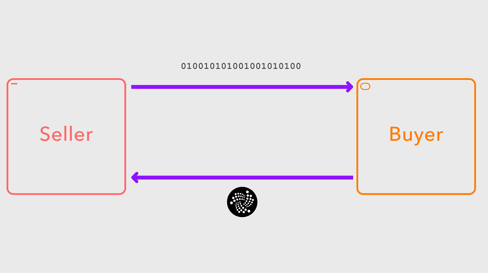

# Streaming Data Payment Protocol on IOTA
## What is it? And what does it mean for IOTA?

No not that type of stream.

As the IOTA team keeps working on the core platform, we are starting to see 2nd and 3rd layer IOTA applications emerge. In keeping with the much used analogy, these are projects akin to SSL encryption or HTTP requests on top of TCP/IP.

I recently came across the [paper](https://github.com/ANRGUSC/SDPP/blob/master/documents/streaming-data-payment-protocol.pdf) for Streaming Data Payment Protocol (SDPP) on top of IOTA's Tangle. In this post, I'm going to attempt to summarize and break it down in terms that you and I can understand, and give my take on what it means for IOTA and the community as a whole. This is the first of my blog posts were I try to do this - so please let me know if you like it, and please suggest other papers or articles for me to summarize!

## One Sentence Summary:

SDPP allows buyers to purchase data streams from sellers.

More like this type of stream.

## Longer Summary:

SDPP is a protocol which defines a relationship between data produers and data consumers. Data producers sell data streams to consumers, which are paid for with microtransactions. All transactions are recorded in an immutable distributed ledger for dispute resolution and auditing.

## Oh. You mean the Data Marketplace

Nope. SDPP actually aims to be platform agnostic, the authors just used IOTA in their first POC (more on this later). While we don't know too much about the data marketplace at this stage, I'm guessing that interoperability isn't going to be the first priority of the IOTA Foundation. Open protocols such as SDPP are great as they foster multiple platforms working together - which to me is much needed in the fragmented world of IoT.

Once could imagine a consumer pulling together streams of data from a bunch of different sources, be that the Data Marketplace, , all using SDPP.

## Why?

Existing IoT applications rely on some pretty heavy-handed vertical integration. Most often, the company using the data collected is also the company deploying and managing fleets of devices. The authors argue some pretty compelling use cases for the need of iot data streams that are more **scalable**, **interoperable**, and could even be on a short time basis. The analogy I'm thinking of here is Netflix scaling up and down their compute capacity on AWS depending on the time of day. 

This could also help prevent the duplication of effort when it comes to data collection that should be monopolized. For example, there's no real point having 2 sets of plumbing in your home - why should there be 2 sensors recording air quality on the same rooftop?

In fact, SDPP and similar approaches turn capital expenses into operational expenses. Sound familiar anyone? Maybe like cloud computing? If this approach takes hold, who knows what possibilites it will unleash? Will there be an IoT service akin to Amazon attaching sensors to all things that move? Or maybe it will democratize data collection, so that highly specialized companies can be set up just for collecting data that they are really good at collecting, and sell those streams to a variety of consumers. Maybe we will even see a role for data aggregators that pull together multiple streams, perform some data cleaning and enrichment for you, and pass on a single stream to an end user. Who knows!

## How does it work

The protocol can be broken down into 3 parts:
1. Data Transport (implemented in TCP)
2. Payment Channel (micropayments in IOTA)
3. Records Medium (recorded on IOTA tangle)

The data transport is pretty straight forward, it can be summarized as JSON encoded messages sent over TCP. Nothing new here. As an aside, one could actually implement the entire thing in IOTA, using MAM for the data transport layer.

The payment channel and records medium are the interesting part however. As I said above, SDPP is platform agnostic. Someone wishing to implement this themselves doesn't even need to use crypto to make the payments, but since IOTA is feeless, it makes good sense to use it. The records medium is used to store orders made by the buyer and invoices generated by the seller in an immutable fashion.

Steps:
1. The Buyer establishes a connection with the Seller
2. The Seller presents a 'MENU' to the buyer, and 
3. The Seller then starts sending data to the Buyer, with the Seller sending back an acknowledgement for every message.
4. After *k* messages, the Seller sends an invoice to the Buyer, and the Buyer pays the invoice. When the invoice is sent, a record is made in a public ledger.
5. When the buyer wishes to disconnect, the Buyer sends the final payment.

## Benefits

One of the things I really like about this protocol is that it has good separation of concerns. This makes it inherently more flexible, and hopefully builds a solid base for further work on micropayments for IoT data streams. It also means that the protocol is platform agnostic - meaning it can be made to work with just about any DLT platform. As it evolves, hopefully it will be picked up by other companies interesting in creating and consuming data streams.

## Further reading:

Has this post piqued your interest? Here's some futher reading:

- Another post of mine: [From Arduino to Tangle](https://medium.com/@lewdaly/from-arduino-to-tangle-4728ddebf211)
- [Intelligent IoT Integrator mentioned in the journal article](http://www.i3-iot.net/)
- [SDPP Github](https://github.com/ANRGUSC/SDPP) - a sample implementation of the protocol

>If you enjoyed this post, or have any suggestions or questions, let me know in the comments. If you liked this post, give it a ❤️ or a 👏, or whatever you crazy cats are calling it nowadays.
>Tips are always welcome 🙌🙌🙌
>BJSLSJNPWSM9QLO9JYJAG9A9LLAUKZAQJGYZLNN9YMBNPCUUS9E9EYE9PIKIKNYHXAPNFAMDGXVIPVKIWGDUVDALPD

Photo by Joao Branco on Unsplash