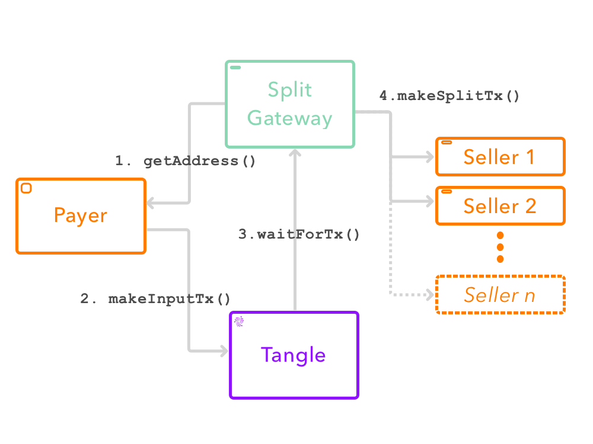

# Splitting ~~Hairs~~ Transactions with IOTA

I've recently come on board the [Tanglefy](insert link) team, to help build the future of eCommerce on the Tangle.

One of the key challenges we need to solve upfront is adding the ability to split transactions on the tangle. In the case of Tanglefy, this is so the platform can take a small fee to keep the lights on, but one could imagine needing to split transactions for other reasons. For example, you could use this approach to automatically pay vendors whenever a product is sold, or perhaps 2 or more parties could sell a product together, each taking a predetermined share of the revenue.

Now I will note that this is a **centralized** approach to splitting transactions, as of yet, there is no way to do this in a trustless manner as with other DLT. We do hope that we will be able to expand on this idea with the advent of the mysterious project Q. For example, sellers on Tanglefy need to trust us that we won't take more than the predetermined cut - which isn't really a problem at the moment, as both buyers and sellers need to trust us for a whole host of other reasons anyway.

In this post, I'm going to outline the basic architecture for how we plan to implement such transaction splits on the Tangle. Will this approach be perfect? No. Will this approach be open to major security flaws? Possibly. Will it be a learning opportunity for both of us? Yes.

Let's dig in.

## The Broad Outline:

Here's the steps we need to make in order to turn a single transaction on the tangle into 2 or more. Actually, before we do that, let's get some names down:
- Let's refer to the service that splits transactions as the **Split Gateway**
- We will refer to the first transaction from the **buyer** to the split gateway as the **input transaction**
- The transactions from the split gateway to the **sellers** are called the **output transactions**

1. Buyer queries the **Split Gateway** API and gets the address that they should pay into. *note: This is a one time address!*
2. Buyer pays over tangle, then notifies the **Split Gateway** that payment has been made, with the transaction and bundle id
3. The Split Gateway waits until the transaction is confirmed on the tangle and then divides the value of the input transaction as per the defined rules, (eg. 50-50, or more of 70-30 split). The **Split Gateway** then gets the each of the addresses for the **output transactions**, (eg. Tanglefy and the seller), and submits those transactions to the tangle.
4. Once all of the **output transactions** are approved, the Split Gateway updates the transaction state to `processed`. It then notifies the seller to ship the product, and informs the buyer that the transaction has gone through successfully.

Make sense? Well I still needed some help, so I drew us a little picture:

## Possible drawbacks:

There are a few issues I need to work through with the above approach:

- How to handle failures? What if any of the output transactions fails? 
  
The good thing about IOTA is that we don't waste our money on fees, but we still need a method for tolerating failure, and possibly rolling back. Perhaps in step 1, the user could send a refund address that the split gateway can pay into if any of the downstream payments fail. One issue with this approach is that the split gateway could then be out of pocket, as the downstream payments would need to be reversed.

- This approach relies on 3rd party state. 

Yes, I know. Ideally we could manage the state on the tangle itself. The prototype I'm working on at the moment uses MongoDB to keep track of the state of the input and output transactions. Perhaps we could come up with a clever way to maintain the state on the Tangle, but we need a database to manage user logins, api keys etc anyway.

- DDOS
We needn't be too worried about this, as we can simply make sure not to initiate downstream transactions if the value of the input transaction is 0. Perhaps the only thing to be worried about is lots of small transactions, but then again, that's one of the whole points of IOTA.

- Getting addresses for downstream payments

This is one I'm a little worried about. Because of the address reuse precaution (notice I didn't say problem ;) ), it's ideal to get a new address for the downstream payments every time. For the input payment, this isn't a problem, as we can store the seed with the Split Gateway, but if one of the payees of the output transactions spends from that address, we're in trouble. 

One option is to create a **holding account** for each payee. Then the payee can manually empty this account and provide us a unique address each time. Another option is that each payee runs a small server that can generate one-time addresses based on their seed. The Split Gateway can authenticate with the server, and get the one time address every time a payment needs to be made. 

I'm going to need to mull on this for a while.

## Next Steps:

Should we pull this off, this approach could be a great way to improve the utility of payments on the tangle. While some might irk at the idea of this as adding fees to a DLT that is meant to be feeless, it enables new applications and services to exist on micropayments. Gotta keep the lights on somehow, right?

I can even imagine these *split gateways* paying into other split gateways at some stage [finish].

As I said above, I'm already building a little POC to see how viable this approach will be. I'm sure I'll keep learning as I go along. If you're interested in following along, check out our repo [here](insert repo link). In fact if you want to contribute, feel free to get in touch! We're looking for developers of all sorts at the moment.

I'm sure I'm going to revise this design a bunch more times, and I'd love your suggestions and input! Feel free to comment below, or reach out to me on the IOTA discord **@lwilld**.

>>If you liked this post, give it a ❤️ or a 👏, or whatever you crazy cats are calling it nowadays.

Donations are always welcome!

`BJSLSJNPWSM9QLO9JYJAG9A9LLAUKZAQJGYZLNN9YMBNPCUUS9E9EYE9PIKIKNYHXAPNFAMDGXVIPVKIWGDUVDALPD`

