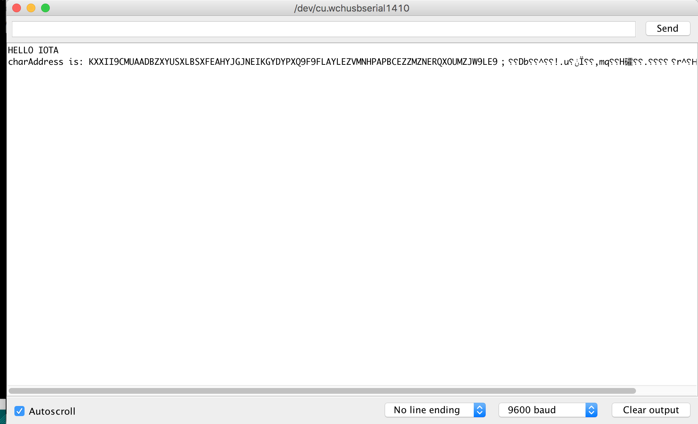

# Getting the C Libraries working on Arduino
## From novice to slightly less novice


One of my ultimate goals with IOTA at the moment is getting it working on MCUs. In a [previous post](insert link), we managed to get an Arduino sending messages over MAM using the Johnny-Five javascript framework. This, I thought, was a good introduction, but still requires the arduino to be connected to my computer, which is less than ideal.

So in order to make things harder for myself (and in the pursuit of learning and all that stuff), I set myself the challenge of getting the [iota lightweight c library](insert link) working on my arduino.

In this post, we're going to look at how to write an Arduino library that takes advantage of the lightweight arduino library. This will be the starting point for a series of blog posts, where we go from starting the library to (hopefully) sending MAM messages directly to the tangle from my D1Mini.
 
*Note: A library of a library? Really? Well as far as I've been able to find, we can't just include the iota library in our arduino code - arduino libraries are quite specific in their structure, and require a little bit of fiddling around to get working nicely. I'm happy to be proven wrong however!*

And just a little disclaimer before we dive in. I originally wanted to get full transactions working (creating bundles, signing bundles, transmitting to the tangle using HTTP requests) before I showed you how I got there, but unfortunately I've run into a few hurdles, and I didn't want to wait to get this post out there and share my knowledge. I am by no means a C or Arduino expert (yet), so have likely made some mistakes that both of us can learn from. 


## Prerequisites

- ESP8266 MCU (I'm using a knockoff D1 Mini, which you can find [here](insert affiliate link))
- Arduino IDE
- `git`


(Note: this guide is mostly written for *nix systems, but if you get it working on windows, let me know and I can update this guide!)


## Setting Up

[From what I've seen on writing arduino](https://www.arduino.cc/en/Hacking/LibraryTutorial) libraries, it's a pretty straighforward process. Libraries can be as simple as a `.h` and `.cpp` file, but for this library, we're going to put out code in a `src` directory, which means we need to define a `library.properties` file.

First of all, navigate to your libraries directory and create a dir for the new library. You can find yours by looking at your `preferences > SketchBook Location` in the Arduino IDE. I changed mine from the default location as you can see.
```bash
$ cd ~/developer/arduino/sketches/libraries/
$ mkdir iota_client
$ cd iota_client
```

Next up, we need to set up some folder structure:
```bash
$ mkdir -p ./src/external
$ touch ./src/IotaClient.c ./src/IotaClient.cpp library.properties
```


## Writing the Library

Now it's time to write some sweet, sweet code. My experience with C++ is limited, so feedback is always welcome!

Open up your `library.properties` file, and put in the following:

```
name=IotaClient
version=0.1.0
author=Lewis Daly
maintainer=Lewis Daly <lewis@vesselstech.com>
sentence=IOTA Client 
paragraph=IOTA Client 
category=Other
url=https://github.com/vesselstech/arduino_iota_client
architectures=*
```

Or something to your liking.

Next up, we need to define our `IotaClient.h` file:

```cpp
#ifndef iota_client_h
#define iota_client_h

#include "Arduino.h"
#include "IotaClient.h"

#ifdef __cplusplus
extern "C"
{
#endif

#include "external/iota-c-light-wallet/src/main.h"
#include "external/iota-c-light-wallet/src/iota/addresses.h"
#include "external/iota-c-light-wallet/src/iota/conversion.h"

#ifdef __cplusplus
}
#endif


class IotaClient {
  public:
    IotaClient(String host, String port);
    void testAddress();

  private:
};

#endif
```

Hopefully for C++ novices (myself included), you can see what's going on here. We're including a bunch of required libraries, and wrap the `iota-c-light-wallet` libraries in an `extern "C"` block, so that the complier knows what to do with them.

After that, we define the `IotaClient` class with 2 public methods. Finally, everything is wrapped in a `#ifndef iota_client_h` and `#endif`, which stops the library from being included twice.

For now, we're only going to implement 2 methods, a constructor and `testAddress()`. Eventually I would like to add some more methods, but we have to start somewhere right? I'll leave this up to you, or for another day.


Let's go on to implement those 2 methods:


```cpp
#include "Arduino.h"
#include "IotaClient.h"

#ifdef __cplusplus
extern "C"
{
#endif

#include "external/iota-c-light-wallet/src/iota/addresses.h"
#include "external/iota-c-light-wallet/src/iota/conversion.h"
#include "external/iota-c-light-wallet/src/iota/transfers.h"


#ifdef __cplusplus
}
#endif


String _host;
String _port;

IotaClient::IotaClient(String host, String port)
{
  _host = host;
  _port = _port;
}

void IotaClient::testAddress() {
  unsigned char address[81];
  char seedChars[] = "DONTEVERUSETHISSEED999";
  unsigned char seedBytes[48];
  chars_to_bytes(seedChars, seedBytes, 81);
  
  get_public_addr(seedBytes, 0, 2, address);
  char charAddress[81];
  bytes_to_chars(address, charAddress, 48);

  Serial.print("charAddress is: ");
  Serial.println((char *)charAddress);
}
```

Let's walk it through section by section. We can ignore the includes at the top for now, we've already mentioned them in the header. 

Here:
```cpp
IotaClient::IotaClient(String host, String port)
{
  _host = host;
  _port = port;
}
```

Is a simple constructor, where we set some instance variables (which we're not going to be using in this tutorial btw).


And the actual juicy bit is here:

First, we start by initializing an array of unsigned chars, with a length of 81, and setting a seed. 
```cpp
unsigned char address[81];
char seedChars[] = "DONTEVERUSETHISSEED999";
```

We then convert the seed to an array of bytes:
```cpp
unsigned char seedBytes[48];
chars_to_bytes(seedChars, seedBytes, 81);
```

Note that `chars_to_bytes()` doesn't return anything, but actually mutates the `seedBytes` char array that we gave it.

Next up, we generate an address. Like with above, this gives us a byte array, so we turn that byte array into a char array that humans can understand:
```cpp
get_public_addr(seedBytes, 0, 2, address);
char charAddress[81];
bytes_to_chars(address, charAddress, 48);
```

Finally, we print it to the serial monitor! Note that the `Serial` class comes along when we include the `Arduino` library.

```cpp
Serial.print("charAddress is: ");
Serial.println((char *)charAddress);
```

## Dependencies

Now I know what you're thinking. What is `external/iota-c-light-wallet`? I haven't seen that before. That's the lightweight C library that a bunch of people (such as `@citrullin`) have been working on. I ended up making a fork of the repo, so I could get it compiling on the arduino. I'll go back and fix these issues later on. Promise.

```bash
$ cd src/external
$ git clone https://github.com/vessels-tech/iota-c-light-wallet.git
```

Alright. We've got a basic library written, and we've got our dependencies, so it's time to dive into the Arduino IDE.

### The Sketch

Open up your Arduino IDE, and make a new sketch. Now I should mention again that I've managed to get this working for a D1Mini. I have tried compiling the library on an Arduino UNO as well, but unfortunately I haven't managed to get it working just yet. Get in touch if you're having trouble - I'm happy to help out!

I've named my sketch `test_d1_client.ino`

```cpp
#include <Arduino.h>
#include <IotaClient.h>

String host = "https://testnet140.tangle.works";
String httpsPort = 443;

IotaClient iota_client(host, httpsPort);

void setup() {
  Serial.begin(9600);
  Serial.println("HELLO IOTA");

  iota_client.testAddress();
}

void loop() {  
}
```

This should be pretty straight forward. There's no magic here, we just include the `IotaClient` library, initialize it with a `host` and `port`, and then call `testAddress()`. Here's what it looks like running on my D1 mini:


And it's working on the D1Mini.


That's it! For reference, you can check out the library here. You could even skip all the above steps, and just include it as an Arduino library from [my github repo](https://github.com/vessels-tech/arduino_iota_client), but then you would miss out on all the fun, wouldn't you!


### Disclaimer

This is a demo only. Please don't use the above seed with actual money. Please don't send money to addresses made with this library. Just don't.


## Acknowledgements

- Thanks to `@citrullin` on Discord for your advice and help!
- Thanks to you, my readers for liking and sharing this piece (now I've just guilt tripped you into doing it - right?)
- Thanks to the people of the IOTA implementation of the Ledger Nano S, which was the basis for the IOTA lightweight C library 


As always, thanks for reading, and please let me know in the comments if you have any suggestions for my code, or are having trouble replicating this. I'd love to chat! You can also reach out to me on the IOTA discord `@lwilld`.


>>If you liked this post, give it a ❤️ or a 👏, or whatever you crazy cats are calling it nowadays.
>>Donations are always welcome!
>>`BJSLSJNPWSM9QLO9JYJAG9A9LLAUKZAQJGYZLNN9YMBNPCUUS9E9EYE9PIKIKNYHXAPNFAMDGXVIPVKIWGDUVDALPD`


