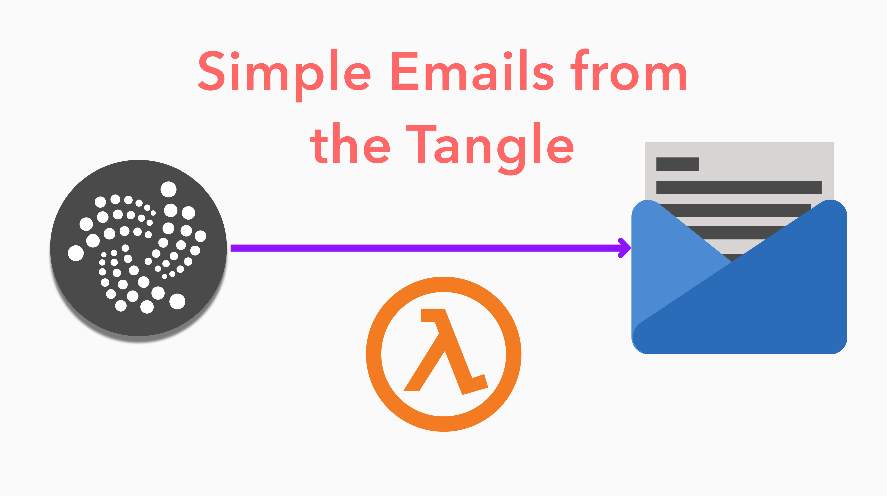
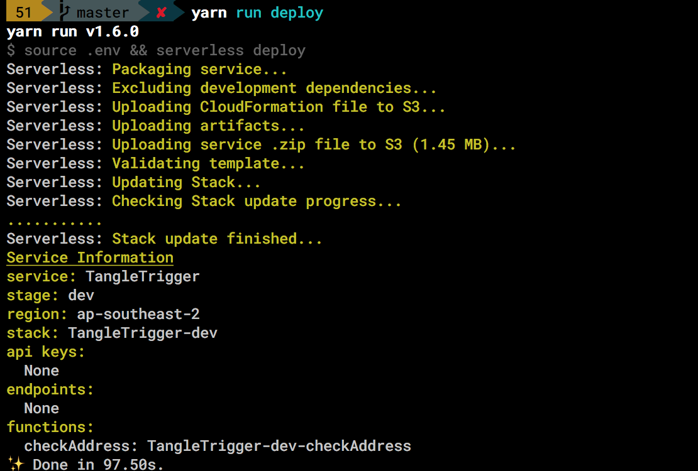
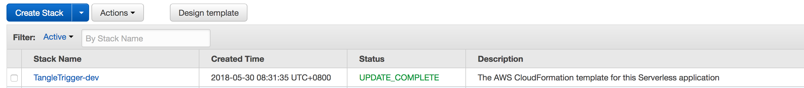
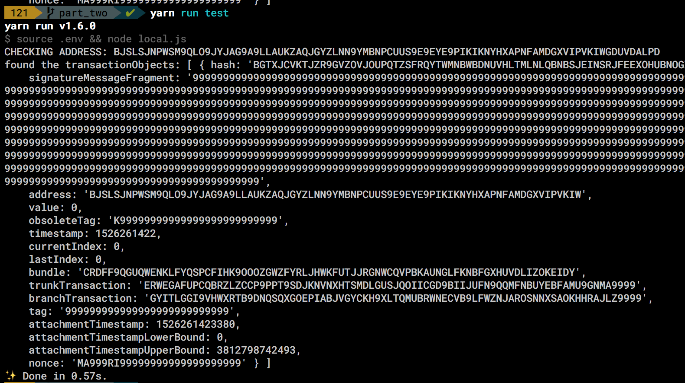
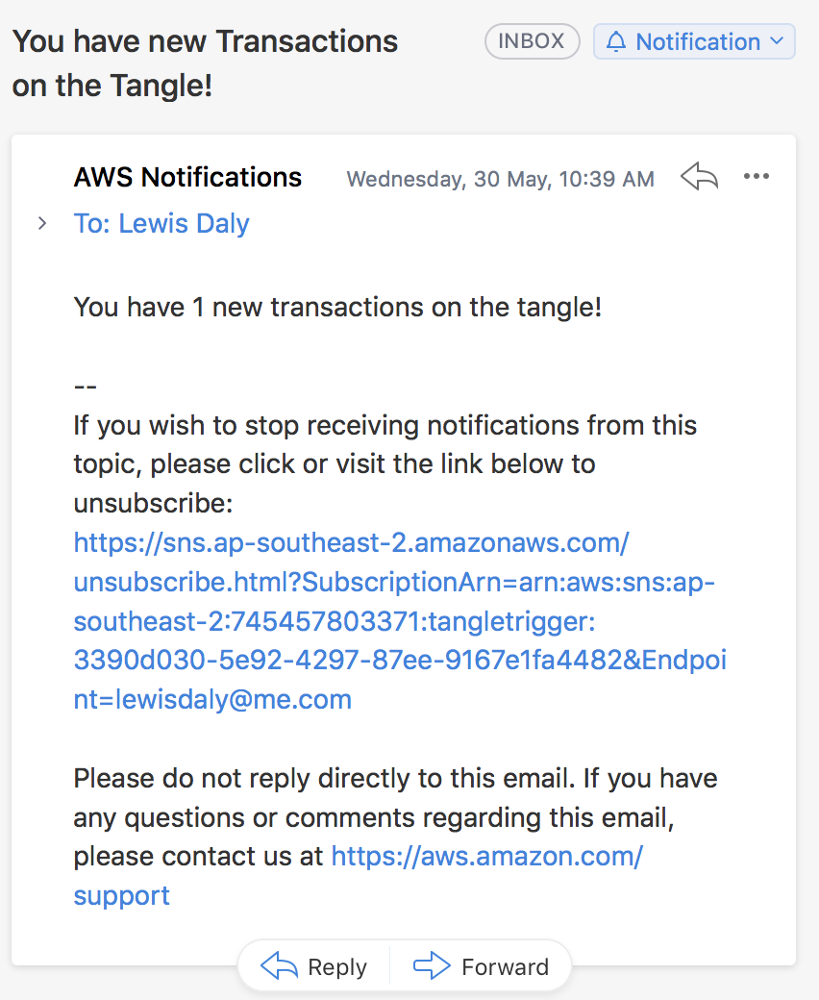
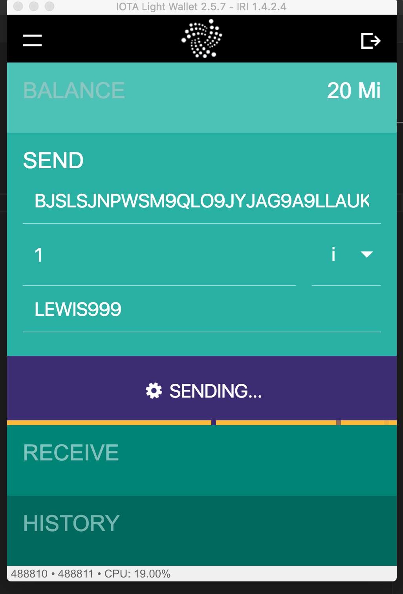
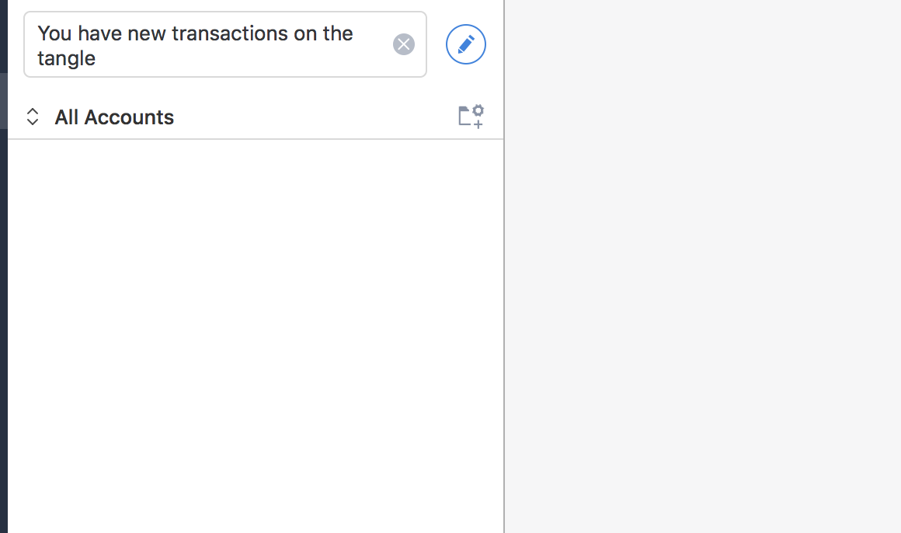
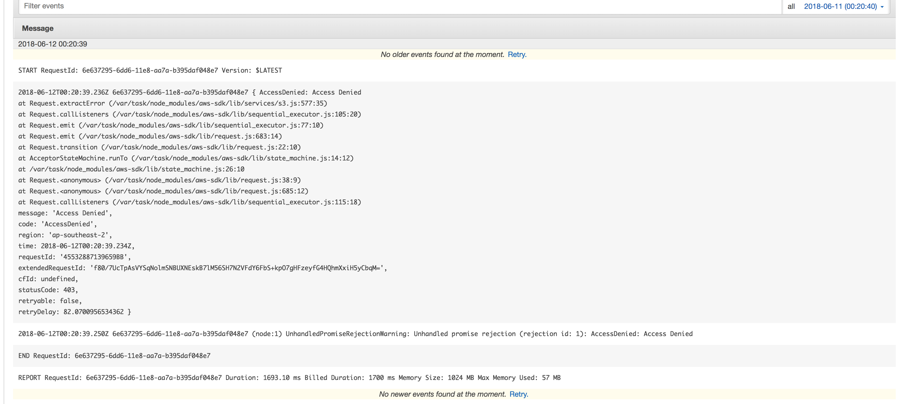
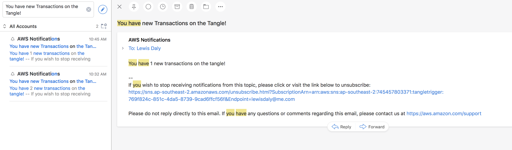

# Triggering Email alerts from the IOTA Tangle
## The DIY Guide




I recently noticed a new project called [Totangle](https://totangle.com/). Totangle integrates the tangle with Zapier, which allows you to integrate things happening on the tangle to your existing APIs or workflows. The first use case they present is setting up an email alert when you get a payment on the tangle.

Inspired by this, and also needing this tool myself (I want to get alerts when I recieve tips from my Medium articles, without having to constantly keep my wallet open), I thought I'd see if I could make an open source lambda function that copies this basic functionality.

## Here's How It Works:

- We write a lambda function that looks for an `address` or `tag` on the tangle every 30 minutes or so. 
- If the lambda function sees new transactions it hasn't previously seen, it sends an email using SNS to my email address.
- Once it has sent the email, it saves the recently seen transactions to some list somewhere - maybe S3 will work for now, or in the future we could use DynamoDB.


## Part One: Setting up the lambda

We're going to use the excellent, albeit poorly named, serverless framework to manage our AWS lambdas and triggers for us.

Let's start by creating a new project.

```bash
$ npm install -g serverless
$ serverless create --template aws-nodejs --path tangle-trigger
$ cd tangle-trigger
$ npm init -y
```

We also need to install the iota library, and set up some nice environment variables

```bash
$ touch .env
$ npm install --save iota.lib.js
```

Let's edit the `.env` file first:
```env
export AWS_PROFILE=default
export IOTA_URL="http://localhost:14265"
export IOTA_ADDRESS="9999"
```
We use the AWS_PROFILE environment variable to control which AWS account serverless deploys to. I quite often have to navigate between accounts, so this environment variable is very helpful.

The two `IOTA_*` environment variables are just placeholder, but I wanted to show you how to get them into the running lambda function.

Let's add a `deploy` script to the `package.json`:

https://gist.github.com/lewisdaly/8b061401ca55cc4f319e5997383be3f9


Next up, we need to modify the Serverless.yml file to define the lambda function and the event triggering the function.

https://gist.github.com/lewisdaly/2611b6786381a495e077c6096739c79d

For now, we are scheduling the lambda function every minute - just so we don't have to wait 30 minutes to debug any problems. You can also see how we are passing through the `IOTA_*` environment variables, which will automatically get placed into the lambda runtime. 

The last thing we need to do is actually write the lambda function! Here's a placeholder `handler.js`

https://gist.github.com/lewisdaly/c2e25024897c75bb661060042427c617

Pretty straightforward, right? But it lets us make sure our environment variables are being passed in correctly, and also ensures that our lambda is being packaged properly with the iota.lib.js dependency.


Let's deploy it, and poke around the AWS console.

```bash
$ npm run deploy
```

You should see some terminal output like the following (I'm using `yarn` instead of `npm` btw).



Navigating to the AWS console, we should be able to see a Cloudformation stack:




A Lambda Function:


and some Cloudwatch logs, which are written every time the lambda is triggered:


## Part Two: Talking to the tangle

Now that we have a basic lambda function running every *n* minutes, we need a way to check for transfers to the tangle of a specific address. We will do this using the `findTransactionObjects()` method on the iota js lib.

Before we implement this however, we should probably make a way to run the serverless function locally, otherwise debugging this function will be a real pain.

Make a new file called `local.js`:

https://gist.github.com/lewisdaly/8d641d6828d89f784433e4a65d96478d

Now we can run `local.js` with the following:
```
$ node local.js
```

You should see something like the following:
```
CHECKING ADDRESS: undefined
```

Alright! It's half working. We need to make sure to source our .env file first. We can put it all together in a npm script:
`package.json
https://gist.github.com/lewisdaly/70ed97a70321b92dd61726bfbec00b58

Now, when we run `yarn run test` (or `npm run test`), we get the following:
```
yarn run v1.6.0
$ source .env && node local.js
CHECKING ADDRESS: 9999
✨  Done in 0.22s.
```

Our environment variables are getting passed in just fine. Let's talk to the tangle

### Talk to the tangle


First, let's put some proper values in our .env file:

https://gist.github.com/lewisdaly/08a5ac7b58bac5a10a1e7e493f53b94f

I'm currently in Singapore, so `durian.iotasalad.org` seems pretty fitting.

And let's update our handler.js to call the api:

https://gist.github.com/lewisdaly/02eac508fef7ef23ae94e5386575bc9f

Now when we run our test, we should get something like the following:



Great! We're able to look up the transfers to a given address! Now we need to count the number of transfers, and make sure we filter out transfers we've already seen. For that, we're going to use AWS S3.

Let's install the aws-sdk:
```
npm install --save aws-sdk
```

And now we need to add a add an s3 bucket to our `serverless.yml` file, as well as a new environment variable:

`serverless.yml`

https://gist.github.com/lewisdaly/d0f745f3c095c125c453acb067463a1c

`.env`
```bash
...
export S3_BUCKET_NAME="tangletrigger"
```


Ok. Now we need to tidy up a little bit, and functions that read and write from s3. Here's what I came up with.

`handler.js`

https://gist.github.com/lewisdaly/b81cffc17fddc74e0b6fe91baeaec9b4


[todo: walk through each function.]

Hopefully this is pretty self explanatory. In this case, we're simply writing new files to our s3 bucket using the tx hash as the key. It's a little lazy, and using database would work much better, but s3 is free and easier to get going with. I'll leave it up to you to to set up a database.


Now when after running this locally again, we can check our aws bucket: (you need to have the aws cli installed, otherwise you can use the web console)

```
$ aws s3 ls s3://tangletrigger/
2018-05-30 10:05:01          6 BGTXJCVKTJZR9GVZOVJOUPQTZSFRQYTWMNBWBDNUVHLTMLNLQBNBSJEINSRJFEEXOHUBNOGXMXKEA9999
```


## Adding an Email Notification

Finally, we need to send an email should we see any new transactions on the tangle. AWS makes this pretty easy with SNS, so first, let's add a new SNS topic to our `serverless.yml`

Our `serverless.yml` section should now look like this:

https://gist.github.com/lewisdaly/8b6c4bd92bc58588cf2815cadcc856f4

Note that we've now defined a SNS topic which will send to an email defined in our `.env` file, and we set it as an environment variable using the `Ref` function, which then gets passed into our lambda. We'll use it below in `publishSNSMessage()`.

Here's our final `handler.js`, with the email settings added in.

https://gist.github.com/lewisdaly/4d9caabc144d37b8f492814bfc9ce762


And here's an email telling me I have new transactions:


Test email. It's getting real now!


Now we just need to change the notification time back to 30 minutes and we can deploy it again.

I'm also going to make a 3 small transactions, and see what happens!


Sending myself 1 IOTA

Now all I need to do is wait around for an email.

After waiting around for an hour or so, this is what I found in my inbox:


Nada. Nothing. Zip.


Let's take a look at our Cloudwatch logs to see what is going on.

I navigated to `CloudWatch` > `Logs` > `/aws/lambda/TangleTrigger-dev-checkAddress`, and selected the latest log (the one at the top).


Hmm. Something seems to be wrong with S3.

Ok. To be honest, I half expected this. What's happening is that the IAM Role that our Lambda function is using doesn't have permission to talk to our S3 bucket, or to publish to the SNS topic we created earlier. It's an easy fix:

Add the following to the provider section in `serverless.yml`:
https://gist.github.com/lewisdaly/9e3b02d3a3d246181cda7a090500f126

This defines the IAM role permissions that our Lambda function executes with, and above we give it permission to read and write to the s3 bucket, and permission to publish to the SNS topic we created.

Let's deploy one more time and see what happens.


IT'S WORKING!

Aaaand it's working. That wasn't so hard, was it? You can check out the full code [here](https://github.com/vessels-tech/tangletrigger), and make sure you check the other branches for each of the steps we went through above.

Did you manage to get this working? Or got stuck? Let me know. I'd love to help. You can also reach me on twitter `@lewdaly`, or on the IOTA Discord at `lwilld`.


>>If you enjoyed this post, or have any suggestions or questions, let me know in the comments. If you liked this post, give it a ❤️ or a 👏, or whatever you crazy cats are calling it nowadays.

>>Tips are always welcome 🙌🙌🙌
`BJSLSJNPWSM9QLO9JYJAG9A9LLAUKZAQJGYZLNN9YMBNPCUUS9E9EYE9PIKIKNYHXAPNFAMDGXVIPVKIWGDUVDALPD`


TODO:
- make pretty pictures
- publish to medium
- update readme to point to medium
- publish to reddit
- post on discord

