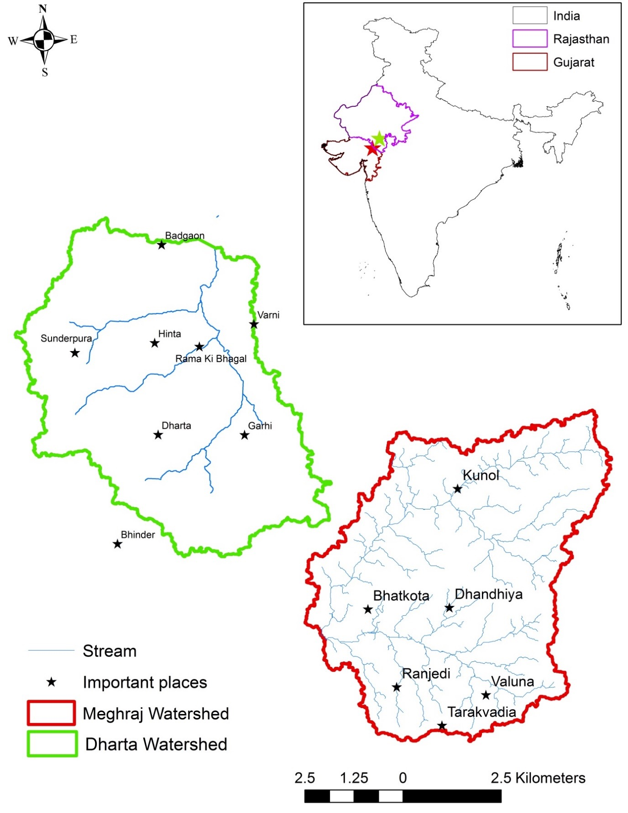

GWIota puts a price on groundwater, enables farmers to better share water, and become more resilient in the face of global warming.

## Groundwater Iota

GWIota is a project we've been considering over the last 6 months. It comes out of our experiences learning about groundwater scarcity in India, and our desire to test out IOTA in the real world - especially in emerging markets.

GWIota utilizes IOTA flash channels for making micro payments between smart pumps, effectively putting a price on groundwater. Instead of paying to a central authority, a smart pump is capable of paying others in a network of collective farmers in a groundwater cooperative. This accurately puts the price of groundwater right where the costs are imposed, on a farmer's neighbour.

## Background

Across India, over 60% of agriculture relies on groundwater. Groundwater is often over-exploited, and groundwater depletion threatens many livelihoods. Existing interventions have been insufficient, and often fail to engage farmers at the lowest level.

For the last 2 years, we have been involved building technology for Project MARVI: Managed Aquifer Recharge for Village Level Intervention. MARVI is a groundwater conservation project that spans 2 watersheds in rural West India. The goal of the project is to build a participatory, bottom-up approach to groundwater management.

Figure 1 - Project MARVI study areas.

One of the key outcomes from Project MARVI has been the inception of Village Groundwater Cooperatives (VGCs). VGCs are a method for smallholder farmers to coordinate and share groundwater together. Farmers agree to share groundwater, and pay one another for groundater [finish] To date, these VGCs have enabled farmers to better understand the state of groundwater scarcity, and are making steps towards making farmers more resilient towards climate change.

GWIota is a next step in building tools for these VGCs. Instead of prices being based on arbitrary guesses about the state of the aquifer, advanced hydrology can be applied and a network of smart water pumps can be rolled out to automatically pay and settle groundwater sharing between farmers.

GWIota will enable these VGCs to put an accurate price on groundwater, making these cooperatives more fair, scalable and climate-resilient.

## How It Works

1. Using historical groundwater measurements and seasonal estimates, determine how much water should be pumped for a given set of wells, and at what price per litre. 

2. Farmers pay (in INR) to secure water for that month, which then gets converted to IOTA, and sent to smart pumps.

3. When a farmer pumps groundwater, the smart pump automatically pays the other smart pumps, according to the price per litre determined in [1].

## Outcomes

- Farmers who have wells which don't perform as well are no longer incentiveised to dig deeper wells to ensure a stable future. They can be compensated by not accessing as much water to pursue other efforts, or grow less grops.

- When the pump runs out of funds, the water runs out.  This prevents over exploitation of groundwater.
>> *note: We may want to set soft/hard limits, or even introduce a penalty for going over the water quota instead of cutting off a farmer completely. The point is that the farmer starts to pay for the cost imposed other farmers.

- This method serves as a platform for other micropayments that will help improve these farmer's lives. For example, by slightly inflating the price for groundwater, we could automatically subscribe farmers to crop insurance.

## Proposed Technology

- IOTA & IOTA Flash Channels
- Smart Pumps
- Rasberry Pi/Lightweight computing platform + Cloud Services for performing PoW and fleet management
- Network access point (sim card or wifi)

## Phase 1

The funding we request for Phase 1 of this project is primarily to demonstrate a real world use case for IOTA, and to show as much "working out" as possible. We want to contribute to the IOTA community, and enourage as many people as possible to get on board with the IOTA revolution.

By the end of Phase 1, we will be poised to implement a field trial, where we can study how this concept and IOTA performs in the real world. We also hope that this will be the beginning of a research paper that can submitted to an academic journal or conference, further bolstering the reputation of IOTA.

### Roadmap: 

**March - June 2018:** Feasibility investigation  
**June - July 2018:** Prototype Development, Landing page development  
**August 2018:** Review, blog posts etc.  

### Deliverables

- Feasibility Study into the use of IOTA for smart groundwater pumps
- Open Source codebase for GWIota 0.1
- A much better name
- At least 3 tutorials on how someone else can build GWIota from scratch themselves, and apply to different intersections of IOT and Payments. Suggested topics include:
  - Using IOTA and Flash Channels for One to Many Payments
  - Making IOTA resilient in low-data situations
- Basic landing page to promote GW Iota and IOTA

Please get in touch if you have any questions this project, or seek clarification on any points.

Lewis Daly

CTO/CoFounder - Vessels Tech  
vesselstech.com  
lewis [at] vesselstech.com  