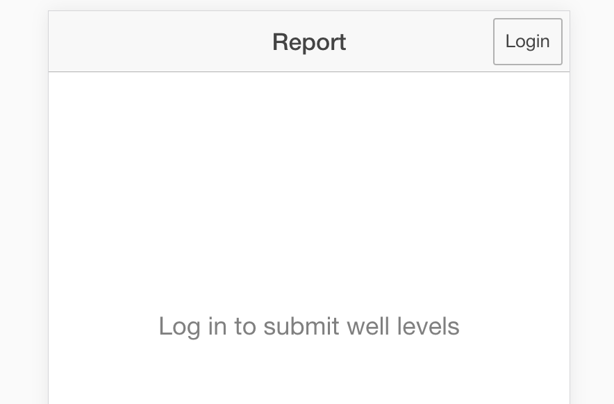

# MyWell User Guide
**MyWell Version 1.3.0**


MyWell is a Smartphone and SMS app for tracking wells in MARVI. The app works by crowdsourcing well, rainfall and checkdam readings from MARVI's network of BJs. MyWell displays the current status of each well, as well as historical and village level data for simple comparison and analysis.

## Contents

<!-- TOC depthFrom:1 depthTo:6 withLinks:1 updateOnSave:1 orderedList:0 -->

- [MyWell User Guide](#mywell-user-guide)
	- [Contents](#contents)
	- [MyWell App](#mywell-app)
		- [The Map View](#the-map-view)
			- [Map Detail](#map-detail)
			- [Statistics](#statistics)
			- [Reading Graphs](#reading-graphs)
		- [Recording](#recording)
			- [Logging in](#logging-in)
			- [Saving a Reading](#saving-a-reading)
			- [Offline readings](#offline-readings)
			- [Bulk Upload (Web only)](#bulk-upload-web-only)
		- [MyWell Settings](#mywell-settings)
			- [Register a new Resource](#register-a-new-resource)
			- [Update a resource's photo (App only)](#update-a-resources-photo-app-only)
			- [Other](#other)
	- [MyWell SMS](#mywell-sms)
		- [Phone Numbers](#phone-numbers)
		- [Message Format](#message-format)
			- [Message Code](#message-code)
			- [saveReading Format:](#savereading-format)
			- [saveReading Examples:](#savereading-examples)
			- [queryResource Format:](#queryresource-format)
			- [queryResource Examples:](#queryresource-examples)
	- [Getting Data in and out of MyWell](#getting-data-in-and-out-of-mywell)
		- [Google Sheets](#google-sheets)

<!-- /TOC -->
## MyWell App
The MyWell App runs on Android or Web.


You can access MyWell web here: [mywell.marvi.org.in](http://mywell.marvi.org.in), or
download the Android app here: [Google Play Store](https://play.google.com/store/apps/details?id=com.ionicframework.ionicrainapp175406&hl=en)

### The Map View
From the map view, you can see all of the different wells, checkdams and rainfall stations that are being monitored in MyWell.

A resource is one of these wells, checkdams or rainfall stations. They each have different icons:


Click on a resource to find out more information.


#### Map Detail
From the popup window of a resource, click **'More'** to find out more about this Well, Checkdam or Rainfall Station.


This page shows the resource's Photo, some statistics at a glance, and a graph of it's readings.

#### Statistics
Current reading
For Wells this is Depth to Water Table, rainfall stations have
The average shows the current average watertable depth
//TODO: more

#### Reading Graphs


The reading graphs show a snapshot of 1 month, 3 month and 1 year long intervals. They show the data collected over the last 3 years, and allow for easy comparison from one year to the next


### Recording
It's easy to record a new reading using MyWell.


#### Logging in
First time users will need to log in, using the login button on the top right hand corner.



From this page, enter the login code that you were provided.


#### Saving a Reading
Steps:
1. Select the type of reading to be recorded


2. Enter in the pincode, date, ResourceId of the reading


3. Fill in any values specific to your reading. For wells, this is WaterTable depth, in metres
4. Click submit, and your reading will be saved

#### Offline readings
If you don't have internet connectivity, your readings will be saved for a later date.
You will see them in a queue below the submit button.


#### Bulk Upload (Web only)
If you want to upload many readings at once, you can drag and drop an excel file here:
[image-11-drag and drop]
Download a template for an example of a correct file from the settings page:


### MyWell Settings
From this page, you can register a new resource, update a resource's image, and find out more information about MyWell. You must be logged in to make any of these changes.


#### Register a new Resource
1. From the settings page, tap 'Register a new Well, Rain Gauge or Checkdam'


2. Drag around on the map, or use  your device's location to set the latitude and longitude of the new resource
3. Enter the pin code, well owner, and the designated Id for the resource.
4. Select what type of resource you are creating, and fill out any more necessary fields


5. Hit 'save'. If everything has been filled out correctly, it will add a new resource.

#### Update a resource's photo (App only)
1. From the settings page, tap 'Change an Image'


2. Enter the Pin code & Id of the resource you want to Change
3. Take a photo and hit 'save'. The photo will be updated

#### Other
You can also download all of the readings in mywell's database as an excel file, and download an example template for bulk uploading many readings at once.

## MyWell SMS
Two of the key MyWell tools are available over SMS as well as through the MyWell app; Recording a new reading, and querying a Well, Checkdam or Raingauge for information.

### Phone Numbers

MyWell has a numbers in the following countries:

| Country       | Number|Service Code
| ------------- |:-------------:|:-------------:
| India         | `+91 97655 56555`| MYWL
| Laos          | `coming soon`| *none*
| Australia     | `coming soon`| *none*

You can send messages to any of the above MyWell numbers.


### Message Format
In order for MyWell to understand the message, the user must follow a strict messaging format.

The format for these messages starts as follows:
```
[<SERVICE_CODE> ]<MESSAGE_CODE>
```
where `<SERVICE_CODE>` is the optional code specifying the service. The default for MyWell is `MYWL`.

>*A note about SERVICE_CODES*
Service codes can serve a dual purpose in the MyWell system. In India, SMS providers share 1 number between many customers. As a result, users are required to specify a code at the start of the SMS, in order to get the message routed to the correct place.

>For deployments of MyWell in other regions, this may or may not be required, but this design decision gives us the ability to share numbers between multiple deployments of MyWell, if this is required in the future.

#### Message Code

`MESSAGE_CODE` is a code denoting the type of message the user will be sending. They are:

| `MESSAGE_CODE` | Method |Description
| ------------- |:-------------:|:-------------
| `S`         | saveReading| saves a new reading.
| `Q`          | queryResource| queries an existing resource. This can be by postcode, village, or individual resource.

- `S` - saves a new reading.
- `Q` - queries an existing resource. This can be by postcode, village, or individual resource.

#### saveReading Format:

The format for a saveReading request is as follows:

```
S <POSTCODE>/<RESOURCE_ID>/[<DATE>/]<READING>
```

>*Note:*
`<DATE>` must be in a YYMMD format, and is optional. If not specified, the reading will default to the current date.

#### saveReading Examples:


- `MYWL S 313603/1501/3000`
"for the service MyWell, save a reading of 3000 units for the resource 1501 in postcode 313603"


- `MYWL S 313603/1501/170101/3000`
For the service MyWell, save a reading of 3000 units for the resource 1501 in postcode 313603 for the 1st of January, 2017


#### queryResource Format:

```
Q <POSTCODE>[/<VILLAGE_ID>|/<RESOURCE_ID>]
```

Where:
`<POSTCODE>` is the postcode containing the resources.
`<VILLAGE_ID>` is a 2 digit ID referring to a group of resources
`<RESOURCE_ID>` is a 4 digit ID, specifying a specific resource within a village. The first 2 digits of the resourceId are the villageId.


#### queryResource Examples:

**Query a Pincode:**

message: `MYWL Q 313603`
"For the service MyWell, get the report for the resources in postcode 313603"

response:
>For pincode 313603, the average depth to water level is 45.54m.

**Query a Village:**

`MYWL Q 313603/15`
"For the service MyWell, get the report for the resources in village 15 in postcode 313603"

response:
>Badgaon has an average depth to water level of 33.34m

**Query a Well:**

`MYWL Q 313603/1512`
"For the service MyWell, get the report for a single resource with id: 1512 in postcode 313603"

response:
>Well 12 in Badgaon has a depth to water level of 23.34m


**Query a RainGauge:**

`MYWL Q 313603/1581`
"For the service MyWell, get the report for a single resource with id: 1512 in postcode 313603"

response:
>Raingauge 81 in Badgaon's last reading was 11mm


## Getting Data in and out of MyWell

MyWell allows you to export your readings into a tsv format, which can be read by Excel or Google Sheets. The export has a limit of 10,000 rows. If you need to export more than this number of readings, contact support for other options.

The url for downloading readings is:
```
https://mywell.vessels.tech/api/readings/exportReadings?pincodes=<pincode list>"
```

where `<pincode list>` is a list of postcodes you want to get the reading data for, separated by commas.
For example, to get the readings from postcodes 313603 and 313604, you would use the url:
```
https://mywell.vessels.tech/api/readings/exportReadings?postcodes=313603,313604"
```

*note: For postcodes with lots of readings, please be patient! It can take a while to download all readings.*

### Google Sheets

You can use the `IMPORTDATA` function in google sheets.

1. On a new sheet go to cell `A1`, and press `=`
2. Enter the function IMPORTDATA(<url>), where <url> is the url for the readings you want to download
3. The table should load sucessfully. If it doesn't load, make sure that your url is formatted correctly.

You can see an example of this working here: https://docs.google.com/spreadsheets/d/1D-SNQevbVzt5Nks2rLOlehaxQDpeujNdkBzdYTGlMgQ/edit?usp=sharing

Feel free to copy this spreadsheet, and change the postcodes to the postcodes you require.
