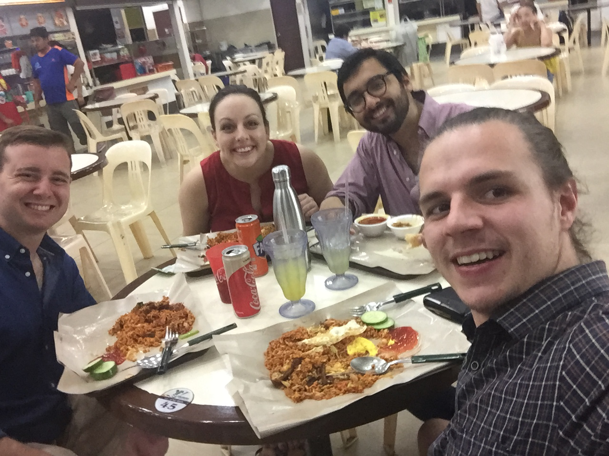
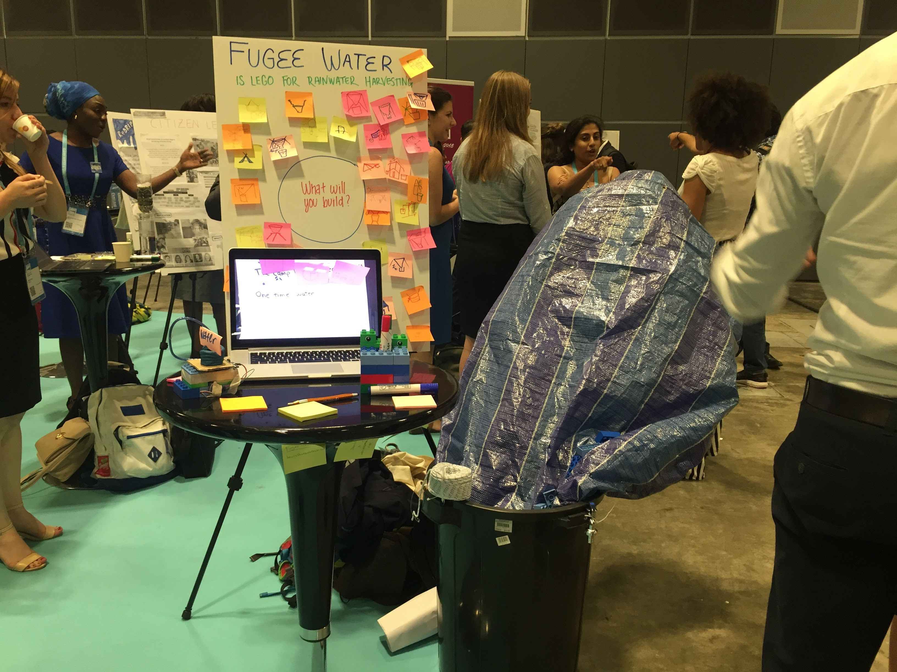
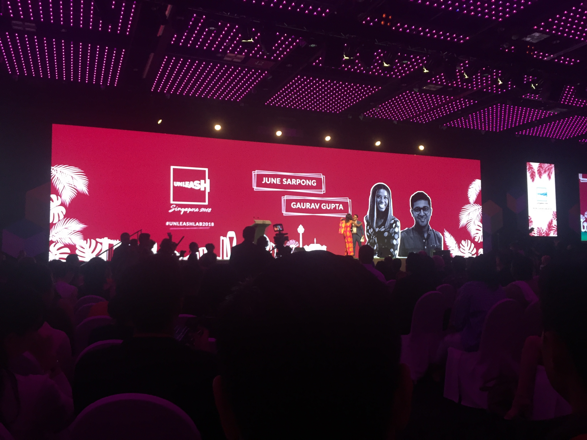

# My Unleash Experience in 6 points.

Last friday (the 8th of June, 2018) I arrived home from the Unleash summit in Singapore. Exhaused from both flying, talking, and working, I crawled into bed and fell asleep for the best part of a day. How did it come to this? 

As I wrote in my previous [post](insert link), I was lucky enough to be 1 of 1000 young talents selected to participate in Unleash's 2018 global innovation summit in Singapore. [Unleash](insert_link) brings together 1000 talents (their word, not mine) from around the world to tangible businesses and innovations in pursuit of the sustainable development goals. 

I'm going to break down my Unleash experience into 6 points: *2 hard things, 2 fun things, and 2 tangible next steps* for myself to take in my career and vocation.

## Hard Thing #1: Gate Checks.

Ok. Let me back up here for you non-unleashers. During unleash, we are divided up into smaller groups based on the sustainable development goals (SDGs) which float your boat. I was in Clean Water & Sanitation, based on my experiences with [MyWell](insert link), and then divided into smaller groups of 4-6 to work on a specific issue related to our SDG. My team were focussed on water scarcity, but more on that later.

Unleash uses an innovation process quite similar to Google Ventures Design Sprint - called ____. The process was made by Deloitte (one of unleashed's sponsors), and came along with some experienced facilitators to guide us through the process. It involves a whole bunch of sticky notes, whiteboard markers and coffee (or tea in my case). 

The process is broken down into 4 distinct phases, with each phase ending in a "Gate". [insert phases]. In order to pass a gate, you must complete the exercises within a phase, and stand up to an intense round of questioning from your facilitators.

Gate checks are kind of like fighting bosses in Zelda, you don't strictly need to beat each boss in a defined order, you can move around from one to another, but you won't finish the game unless you beat all of them. 

So gate checks were hard. They forced us to give mini-pitches as we were going along, kept our team on track, and sometimes felt like we were jumping through hoops for the sake of the hoops. In hindsight however, most of these hoops were rather necessary.

And the team?

That's right, before we go any further, I should introduce you briefly to my team, and the challenge we aimed to solve. Our team  - a.k.a Fugee Water - was Steve (Germany), Arielle (USA), Naveed (USA), Michael (USA), and myself, from Australia.

The team minus Steve (sorry Steve)

Our team was looking at the water scarcity issues inside the Rohingya refugee camps in Bangladesh. I'm going to write more extensively about this issue in a later post (so please follow me to keep up to date!), but in summary:
- There are 1.3 million refugees living in camps in Bangladesh, who have fled from Myanmar. These camps lack a sustainable supply of water
- Long term infrastructure, or relocation is not an option
- Fugee Water aims to help this problem by giving families living in the camps the means to harvest rainwater themselves, which will reduce the dependence on groundwater and surface water in the monsoon season, freeing up groundwater for better use in the dry season. 

## Hard Thing #2: Pitching

Pitching is hard. And I don't just mean pitching to judges and our peers in water, but pitching to the greater Unleash community, and complete strangers at the sustainable ____ expo.

On the penultimate day of Unleash, we had only a few hours (after completing our other deliverables) to throw together a coherent pitch that highlighted the problem we were aiming to solve, our solution, and its impact on the Rohingya refugees. This was not an easy task, and our whole team felt we could've done better. We should've focussed more on the solution instead of the problem, and we came up with the idea of "Lego for rainwater harvesting" far too late. (I've teased this solution far too much now, you're really going to want to read the next post).

The great thing was that we had a chance to set up an expo where we demonstrated our solution, and got to pitch 10, no 20, no 30 times to complete strangers. It was like elevator pitching 101. (Side note, next time you're in an elevator with me: watch out!).

Our stand at the expo.

We also got to try out some cool engaging tactics - such as asking people what rainwater harvesting solution they might build if we gave them 4 bamboo sticks, a bucket and a tarp.

## Fun Thing #1: Meeting People

Even before going through the innovation process, before hearing from inspiring leaders in the sustainable development space, or before playing with Lego on day 1; bringing together 1000 young people who are passionate about pursuing the sustainable development goals, and passionate about lifting up the lives of those in poverty has a net positive effect. 

I was so encouraged and inspired by those who share a similar passion to mine, and the relationships forged (in the fire perhaps), over the last week will be more than just shallow "networking" to get ahead, but hopefully form into long running partnerships in pursuit of something bigger than any rational self-interested individual can achieve on one's own.

## Fun Thing #2: Exploring Singapore

It's no lie. I love Singapore. From its sweeping vistas to its orderly queues; from its functioning MRT to its culinary delights; The Garden City feels like a home away from home to me (albeit a more humid home). 

Singapore is also a world leader in many of the sustainable development goals. I was inspired when we vistited the NeWater plant - a wastewater treatment plant which embodies Singapore's commitment to sustainablity. Singapore also seems to be establishing itself as a home to businesses pursuing such goals, and we heard much from the National University of Singapore and Nanyang Technological University where much of this cutting-edge research seems to be happening.

## Next Step #1: Taking Unleash back to Vessels Tech

At [Vessels Tech](vesselstech.com) (my tech 4 dev company), we are passionate about seeing technology used to lift up the lives of others. While we have always had a focus on sustainablity, I'm now starting to see our projects in light of the sustainable development goals. Take just two of our projects for example:

- [MyWell](https://vesselstech.com/mywell.html), for example support SDG6: Clean water and sanitation for farmers and their families, as well as 1 (No Poverty), 12 Responsible Consumption & Production, and 13 Climate Action

- [4PBot](https://4pbot.com/) by pursuing financial inclusion supports #1, #3 Health and Well Being, and #10 on Reducing Inequality

Unleash has helped me renew my focus on sustainablity, and given me an extra burn for furtering these sustainable development goals at Vessels Tech.

## Next Step #2: Pursuing new ventures

Our team, Fugee Water, had a great time at unleash. We came from a diverse set of backgrounds, and came together to 

The simple truth is this: The Rohingya refugee crisis is the worst humanitarian crisis in history. It's not the only crisis we face right now, nor will it be the last.

Instead of looking at these crises as a net negative, how can we change our perspective on the opportunities here? What are the opportunities for Bangladesh to become a hub for manufacturing products for disaster relief? Or how might we lift up these refugees into positions of power, where they might be able to build sustainable businesses?

So this is what I'm going to be dedicating a considerable amount of effort into looking into. Can we get Fugee Water off the ground? I hope so. But what are the other ways we can prevent such crises, or enable people to bounce back from such situations? I'm not sure. If you want to brainstorm with me, leave a comment below or get in touch at lewis [at] vesselstech.com.

>>"The business opportunity is enormous – after all, the market size for the SDGs is the population of the whole planet"

As Garauv Gupta - director at Dalberg - put it, "The business opportunity is enormous – after all, the market size for the SDGs is the population of the whole planet" [1]. I sure want to be a part of these types of businesses.

## In Summary

The closing ceremony. Look at all those beautiful LED screens!

"This is not the end, it's the end of the beginning", said Chairman of Unleash, Flemming Besenbacher, at the closing ceremony of Unleash. And I agree with him. Unleash isn't about going home with good stories, or a full belly - it's about inspiring a generation of leaders in the Sustainable Development Goals, and them in turn inspiring others.

In these 6 points, I hope I captured some of the essence of Unleash, and I hope I encouraged you to pursue the sustainable development goals - whether that's inside of your existing work, as you study, or as you set out on new ventures.

Finally, I'd like to say thanks to just some of the sponsors who made Unleash possible:
- DBS, for letting us blow off steam on the Marina Regatta
- NUS, for housing, feeding and clothing us
- Deloitte, for lending us your expert facilitators, and training us up in the innovation process
- Calsberg, for the beer (need I say more?)
- Lego, for inspiring us to keep on playing! 

Stay tuned for more from myself and Vessels Tech - I'd love to hear from you if you want to work with me, partner with team Fugee Water, or just have any feedback. Leave a comment below, or email me at lewis [at] vesselstech.com.

[1] https://www.linkedin.com/pulse/singapore-silicon-valley-addressing-global-challenges-gaurav-gupta/?lipi=urn%3Ali%3Apage%3Ad_flagship3_profile_view_base%3BbTo%2FeYT7RIuCVirDXdU7og%3D%3D