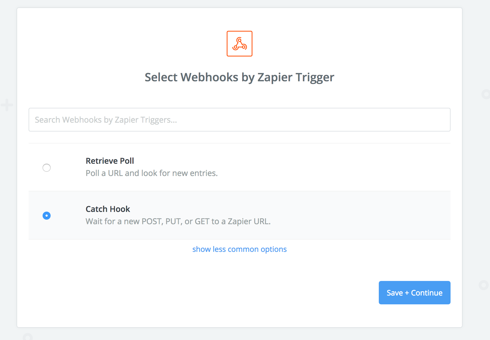
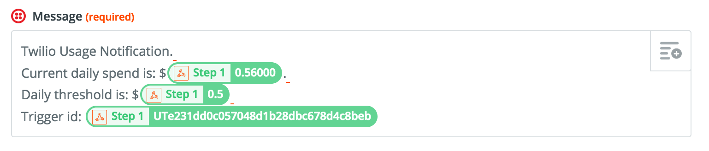

Over the last few months, I've been using Twilio _(a.k.a. the AWS of calls and sms)_ extensively for one of my projects at [Vessels Tech](https://vesselstech.com). I've been really impressed with the API, tooling, and general ease of use.

Unfortunately, like many other pay-as-you-go cloud service providers, Twilio doesn't have any easy way to set a limit on your daily spend.(There is a way using [sub-accounts and circut breakers](https://support.twilio.com/hc/en-us/articles/223132387-Protect-your-Twilio-project-from-Fraud-with-Usage-Triggers), but this felt like too much work for my afternoon). After enabling outbound calls to what they call "High Fraud Risk" countries, I got sufficently spooked and decided to do something about it. 

So here's a few curl scripts and zapier configuration you can copy to set up your own twilio usage triggers like me.

## The Zap

Let's start with setting up Zapier to tell Twilio to send us an SMS.


1. Login to Zapier > "Make A Zap"
2. Create a new Webhook Zap, which listens for a POST

3. Leave the child keys blank, we won't need them here
4. At the the "Test this Step" section, copy the webhook and paste it in the above scripts or as an environment variable in `create_usage_trigger.sh`. You can test this by skipping ahead and creating a usage trigger with a low threshold. 

5. Next, add a "Twilio" Step, and select "Send SMS"
6. Connect your account using your Account SID and Auth Token
7. Edit your template with __From__ and __To__ numbers, and add your message. For reference, this is mine:

8. Hit continue and "Save", and make sure to turn on your Zap!


Now let's look at the scripts to create and manage the usage triggers.

## The Scripts

Twilio does have an API feature called __Usage Triggers__ which you can use to trigger a postback to a URL. I was initially hoping I could use a Usage Trigger to send me an email or SMS message right within Twilio, but suprisingly, we have to implement that functionality ourselves. We also don't get a pretty UI to look at, but with bash, who needs that? 

`create_usage_trigger.sh`
```bash
#!/usr/bin/env bash

curl -XPOST https://api.twilio.com/2010-04-01/Accounts/$TWILIO_ACCOUNT_SID/Usage/Triggers.json \
    -d "CallbackUrl=$CALLBACK_URL" \
    -d "UsageCategory=totalprice" \
    -d "FriendlyName=test_trigger" \
    -d "TriggerBy=price" \
    -d "TriggerValue=5.0000" \
    -d "Recurring=daily" \
    -u "$TWILIO_ACCOUNT_SID:$TWILIO_AUTH_TOKEN"
```

This is a simple trigger that will call a given callback url (we'll set that up in a second) whenever our daily spend goes above $5. I've also formatted a couple other commands you can use to get and delete existing triggers:

`cleanup_usage_trigger.sh
```bash
#!/usr/bin/env bash

TRIGGER_ID="$1"

curl -XDELETE https://api.twilio.com/2010-04-01/Accounts/$TWILIO_ACCOUNT_SID/Usage/Triggers/$TRIGGER_ID.json \
    -u "$TWILIO_ACCOUNT_SID:$TWILIO_AUTH_TOKEN"
```

`get_usage_trigger.sh`
```bash
#!/usr/bin/env bash

curl -G https://api.twilio.com/2010-04-01/Accounts/$TWILIO_ACCOUNT_SID/Usage/Triggers.json \
    -d "TriggerBy=price" \
    -u "$TWILIO_ACCOUNT_SID:$TWILIO_AUTH_TOKEN"
```

Pretty easy right? I also found that you can use get_usage_trigger to see where your currently daily spend is at, which is helpful for testing and making sure your configuration is working.


And that's about it. Let me know if you got this working or got stuck at any stage. I'm happy to help.

If you're looking for someone to design and build a chatbot solution for you - whether that be over voice, sms, ussd, messenger - you get the idea - feel free to get in touch!


>>If you enjoyed this post, or have any suggestions or questions, let me know in the comments. If you liked this post, give it a ❤️ or a 👏, or whatever you crazy cats are calling it nowadays.

